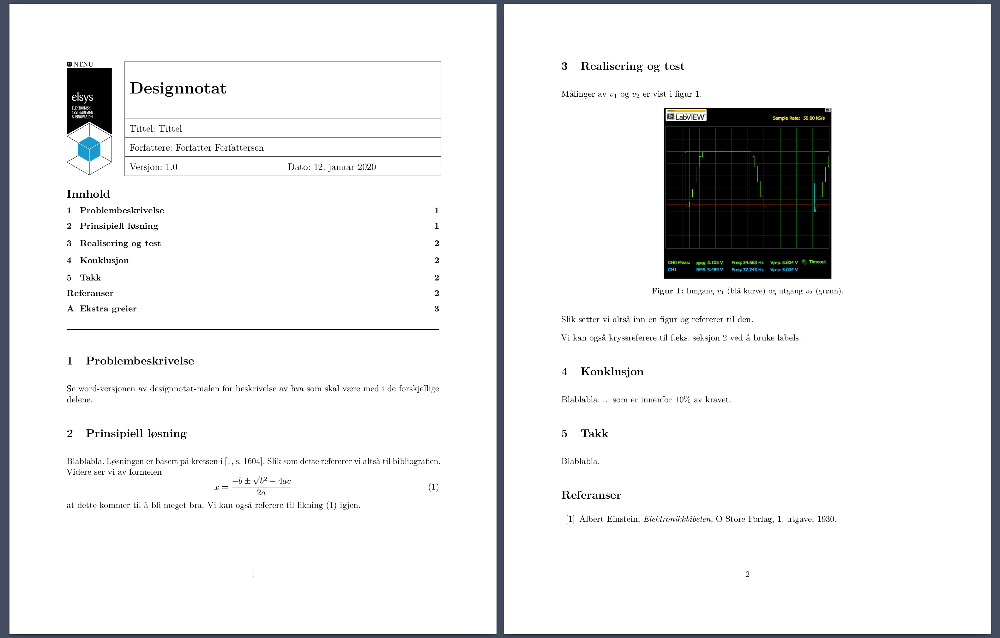

# Elsys Designnotat - Latex class

Designnotatklasse for designprosjekter i elsys på NTNU. 

## Hva?
Dette er en documentklasse (document class), som betyr at du bruker `\documentclass{elsys-designnotat}` i starten av LaTeX-documentet ditt. Klassen innfører dokumentstilen for hele notatet, og legger til alle pakker som kan bli brukt.

## Installasjon
Certainly the easiest way to start using this template is to copy the .cls file to your computer in the same directory as your LaTeX project directory.

Den enkleste måten å installere klassen er å kopiere `elsys-design.cls` og `elsys-design.png` til samme folder som dokumentet ditt. Deretter bare bruke `\documentclass{elsys-designnotat}` på starten av dokumentet.

### Anbefalt installasjon

For å bruke LaTeX-klasser globalt må de ligge i en global mappe på maskinen din. Dette er avhengig av hvilket operativsystem og hvilken LaTeX du bruker, og vil dermed variere. For å finne denne mappen, kan du bruke kommandoen `kpsewhich -var-value=TEXMFHOME` for å finne rot-mappen for filer til LaTeX. På linux pleier denne å være `/home/USERNAME/texmf/`.

I mappen som kommandoen returnerte så må det lages to mapper, `tex/latex`. Dermed vi hele lokalisjonen til mappen være `/home/USERNAME/texmf/tex/latex`.

Deretter skal må filene `elsys-design.cls` og `elsys-design.png` linkes (eller kopieres) til denne mappen. Kommandoene under kan brukes fra mappen med klassen.

```bash
ln -s <path-to-your-clone>/*cls /home/USERNAME/texmf/tex/latex/
ln -s <path-to-your-clone>/*png /home/USERNAME/texmf/tex/latex/
```

Der `USERNAME` byttes ut med ditt eget brukernavn og `<path-to-your-clone>` er lokalisjonen til mappen med klassen (.cls-filen).


## Bruk

Se eksempelfilen [designnotat.tex](eksempel/designnotat.tex) med tilhørende PDF [desginnotat.pdf](eksempel/designnotat.pdf). Det er kommentarer som forklarer hva ting gjør.

Klassen produseres dokumenter som følgende.




## Inkluderte pakker

For inkluderte pakker, er det bare å se hvilke pakker som er lagt til av `\RequirePackage{}` i [elsys-design.cls](elsys-design.cls).


## Lisens
MIT Lisens, see [LICENSE](LICENSE).
